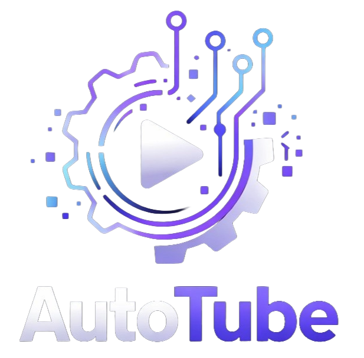
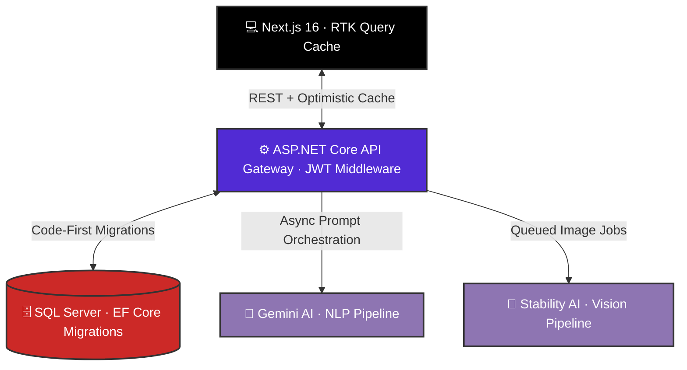

<div align="center">


### _The Ultimate AI-Powered YouTube Automation Platform_

**Built by creators, for creators. Transform ideas into YouTube masterpieces in minutes, not hours.**

</div>

---

<div align="center" style="margin: 25px 0;">
  <a href="https://auto-tube-eight.vercel.app/" target="_blank" rel="noopener noreferrer">
    
  </a>
  <a href="https://drive.google.com/file/d/1AxNrsyqNnEwHF0JS3tYuKVze0SFehUlb/view?usp=sharing" target="_blank" rel="noopener noreferrer">
    
  </a>
</div>

<div align="center">


</div>

---

<br/>

## 📝 Table of Contents

<div align="center">
  <br>
  <b><a href="#-the-mission">MISSION</a></b> &nbsp; • &nbsp; 
  <b><a href="#-the-engine-from-manual-to-orchestrated">CORE ENGINE</a></b> &nbsp; • &nbsp; 
  <b><a href="#-system-architecture">ARCHITECTURE</a></b> &nbsp; • &nbsp; 
  <b><a href="#️-the-tech-stack">TECH STACK</a></b> &nbsp; • &nbsp; 
  <b><a href="#-system-modules--features">MODULES</a></b>
  <br><br>
  <b><a href="#-project-structure">PROJECT STRUCTURE</a></b> &nbsp; • &nbsp; 
  <b><a href="#-governance--quota-engine">GOVERNANCE</a></b> &nbsp; • &nbsp; 
  <b><a href="#-getting-started-local-development">SETUP</a></b> &nbsp; • &nbsp; 
  <b><a href="#future-enhancements">FUTURE ENHANCEMENTS</a></b> &nbsp; • &nbsp;
  <b><a href="#-team--acknowledgments">TEAM</a></b>
  <br><br>
</div>

---

## 🚀 The Mission

**AutoTube** bridges the gap between ideation and production, transforming fragmented workflows into a single, AI-orchestrated engine.

<div align="center">

| ⏱️ Efficiency                        | 🧩 Workflow                                           | 📊 Data-Driven                         | 💰 Scalable                      |
| :----------------------------------- | :---------------------------------------------------- | :------------------------------------- | :------------------------------- |
| Automate the full content lifecycle. | Chain Gemini, Stability, Replicate, Flux pro & PIAPI. | Strategy grounded in real performance. | Built-in, credit-metered system. |

</div>

---

### 🎯 Core Objectives

- **Frictionless Production:** Minimize manual research and drafting.
- **AI Orchestration:** Ecosystem-aware pipelines beyond simple wrappers.
- **Contextual Grounding:** Content generation backed by performance data.
- **Enterprise-Ready:** Secure, multi-tenant infrastructure built for scale.

---

## ⚡ The Engine: From Manual to Orchestrated

Content creators face massive burnout juggling disconnected tools. **AutoTube** collapses that pipeline into a single, credit-metered engine, integrating **real-time YouTube Data API** directly into the generation loop.

<div align="center">

| Feature        | The Old Way          | AutoTube (Unified)             |
| :------------- | :------------------- | :----------------------------- |
| **Discovery**  | Manual guesswork     | Automated Content Gap Analysis |
| **Production** | 5+ disconnected subs | Orchestrated AI Pipeline       |
| **Strategy**   | Blind AI generation  | Metric-aware generation        |
| **Billing**    | Fragmented costs     | Single-ledger credit system    |

</div>

---

## 🧠 System Architecture

AutoTube is a **decoupled, three-tier system**: Next.js client, stateless ASP.NET Core Gateway, and a SQL Server persistence layer. AI providers are treated as swappable, outbound-only dependencies behind interfaces.

<div align="center">



</div>

### 🔐 Request Lifecycle: The "Hardened" Path

Every mutating request follows a strict, high-reliability flow designed to ensure platform stability and security:

- **1. Auth Guard:** Requests carry a JWT via `httpOnly` storage; `AuthMiddleware` rejects unauthenticated traffic before hitting business logic.
- **2. Quota Guard:** The Service Layer verifies credits via `IUserRepository` — **zero AI calls** are executed if the credit balance is insufficient.
- **3. Async Dispatch:** Lightweight tasks (scripts) run inline; heavy tasks (video/images) are offloaded to **Hangfire background workers**.
- **4. Cache Sync:** RTK Query tags (e.g., `Script`, `Quota`) auto-invalidate upon response, triggering instant UI updates with zero manual reloads.

---

## 🛠️ THE TECH STACK

**Engineered for performance, reliability, and AI-first orchestration.**

<div align="center">

| Layer        | Primary Tech                                   | Key Capabilities                                   |
| :----------- | :--------------------------------------------- | :------------------------------------------------- |
| **Frontend** | Next.js 16, React 19, TS                       | SSR/SSG, RTK Query, Tailwind v4, Framer Motion     |
| **Backend**  | ASP.NET Core 8, C# 12                          | RESTful API, Hangfire (Queues), Polly (Resilience) |
| **Data**     | SQL Server, EF Core                            | ACID Compliance, Relational Billing, Migrations    |
| **AI Layer** | Gemini, Flux Pro, Stability, PIAPI , Replicate | NLP, Vision/Thumbnail Generation, Video Pipeline   |
| **Auth/Ext** | Google OAuth, YouTube Data                     | Identity Management, Channel Analytics & Insights  |

</div>

---

## 🧩 SYSTEM MODULES & FEATURES

**A comprehensive, end-to-end platform built to automate the YouTube lifecycle.**

### 🔐 1. Identity & Security (IAM)

- **Authentication:** Traditional Email/Password registration alongside **Google OAuth** Single Sign-On (SSO).
- **Session Management:** Stateless, secure **JWT-based** sessions.
- **Data Protection:** Industry-standard secure password hashing and encryption.

### 🎬 2. The AI Production Studio

- **Idea Generation:** **Gemini-powered** topic suggestions dynamically tailored to your specific channel niche and current market trends.
- **Smart Scripting:** Generate full video scripts with customizable tone, length, and structure. Includes an **editable output step** before finalizing production.
- **Thumbnail Generation:** Create high-converting thumbnails using **Stability AI and Flux**. Features multiple style options, live previews, and direct downloads.
- **Video Generation:** Produce short-form video clips powered by **PiAPI**. Includes **real-time progress tracking** for long-running render jobs.

### 📈 3. Analytics & Intelligence

- **YouTube Data Integration:** Deep integration with **YouTube Data API v3**.
- **Channel Metrics:** Real-time tracking of view counts, subscriber growth trends, and top-performing videos to inform future content.

### 🎛️ 4. Dashboards & Management

- **User Workspace:** A centralized hub providing an overview of all generated content, historical quota usage, and quick-access shortcuts to creation tools.
- **Admin Command Center:** Platform-wide oversight featuring comprehensive user management, system usage statistics, and quota configuration.

### 💳 5. Billing & Quota Engine

- **Usage Tracking:** Real-time monitoring of generation credits.
- **Tiered Access:** Plan-based quota tiers with strict per-user generation limits to ensure platform stability and scalability.

---

## 📂 Project Structure

```
AutoTube/
│
├── AutoTube-API/                    # Backend — ASP.NET Core Web API
│   ├── Advacedhelp/
│   ├── Behaviors/                   # MediatR pipeline behaviors (validation, logging)
│   ├── Commands/                    # CQRS command definitions
│   ├── Configuration/               # Service registration and app configuration
│   ├── Controllers/                 # API endpoint controllers
│   ├── Data/                        # DbContext and EF Core configuration
│   ├── DTOs/                        # Data transfer objects
│   ├── Exceptions/                  # Custom exception types and handlers
│   ├── Handlers/                    # CQRS command and query handlers
│   ├── Models/                      # Domain entities and data models
│   ├── Properties/                  # Launch settings
│   ├── Queries/                     # CQRS query definitions
│   ├── Repositories/                # Data access layer
│   ├── Services/                    # Business logic and external API services
│   ├── wwwroot/
│   │   └── uploads/
│   │       ├── thumbnails/
│   │       └── Videos/
│   │           ├── Clips/
│   │           └── Merged/
│   ├── appsettings.json
│   ├── Autotube.csproj
│   └── Autotube.http
│
└── frontend/                        # Frontend — Next.js + TypeScript
    ├── public/
    ├── src/
    │   ├── app/                     # Next.js app router (pages and layouts)
    │   ├── components/              # Reusable UI components
    │   │   ├── feature/
    │   │   ├── layout/
    │   │   └── ui/
    │   ├── constants/               # App-wide constants and enums
    │   ├── hooks/                   # Custom React hooks
    │   ├── lib/                     # Utility functions and helpers
    │   ├── schemas/                 # Zod or validation schemas
    │   ├── services/                # API service layer (HTTP clients)
    │   ├── store/                   # Global state management
    │   └── types/                   # TypeScript type definitions
    ├── .gitignore
    ├── .prettierrc
    ├── AGENTS.md
    ├── CLAUDE.md
    ├── CONTRIBUTING.md
    ├── eslint.config.mjs
    ├── next.config.ts
    ├── package.json
    ├── postcss.config.mjs
    ├── tsconfig.json
    └── README.md
```

---

## 👥 GOVERNANCE & QUOTA ENGINE

**Robust Role-Based Access Control (RBAC) seamlessly integrated with a metered AI billing architecture.**

### 🎭 System Roles

<div align="center">

| Role               | Access Scope & Capabilities                                                                                   |
| :----------------- | :------------------------------------------------------------------------------------------------------------ |
| **Administrator**  | Full platform oversight. Manage user accounts, override quotas, and monitor system health & logs.             |
| **Creator (User)** | Access the AI studio, link YouTube analytics, manage generated history, and track personal quota consumption. |

</div>

---

### ⚖️ The Quota Architecture

Every creator operates within a **Plan-Based Quota Tier** that strictly meters AI consumption to ensure platform sustainability.

<div align="center">

| AI Resource              | Tracked Metric  | Replenishment |
| :----------------------- | :-------------- | :------------ |
| **Idea Generation**      | API Requests    | Monthly Reset |
| **Script Generation**    | API Requests    | Monthly Reset |
| **Thumbnail Generation** | Rendered Images | Monthly Reset |
| **Video Generation**     | Rendered Clips  | Monthly Reset |

</div>

<br>

**⚙️ Enforcement & Tracking Rules:**

- **Transparent Tracking:** Creators monitor their real-time credit balance directly from the User Dashboard.
- **Hard Circuit Breaker:** Exceeding the assigned quota blocks further generation until the next monthly reset or a plan upgrade.
- **Admin Flexibility:** Administrators hold the authority to manually adjust, refill, or reset individual user quotas on demand.

---

## 🚀 GETTING STARTED (Local Development)

**Prerequisites:** Node.js 20+, .NET 8 SDK, SQL Server.

### 1. Clone & Install

```bash
git clone https://github.com/shefo72/AutoTube-Project
cd AutoTube-Project
```

### 2. Run the Backend (ASP.NET Core)

```bash
cd AutoTube-API
dotnet restore
dotnet ef database update
dotnet run
```

### 3. Run the Frontend (Next.js)

```bash
cd frontend
npm install
npm run dev
```

> **Note:** Ensure all environment variables (Gemini API, YouTube Data API, Database Connection String) are properly configured in both `.env.local` and `appsettings.json` before running.

---

## <a id="future-enhancements"></a> 🗺️ Future Enhancements

**The architecture is built to scale. Here is our engineering vision for the next iteration of the AutoTube ecosystem.**

| Epic / Feature                     | Strategic Value & Implementation                                                                                                                          |
| :--------------------------------- | :-------------------------------------------------------------------------------------------------------------------------------------------------------- |
| **🎯 Niche Hyper-Personalization** | A persistent "Creator Graph" that automatically biases and tailors all AI outputs to the user's specific channel goals and unique style.                  |
| **🧠 Prompt Auto-Optimization**    | An intermediary layer that dynamically analyzes, refines, and enriches user prompts based on output quality and feedback before hitting the AI providers. |
| **🔮 Predictive Recommendations**  | An advanced recommendation engine suggesting trending topics and content gaps, directly informed by deep YouTube channel analytics.                       |
| **🔌 Expanded AI Ecosystem**       | Broadening our provider-agnostic infrastructure to plug in additional cutting-edge Image and Video generation models for maximum creative flexibility.    |
| **🌍 Global Localization (i18n)**  | Native multi-language support to generate scripts, metadata, and ideas, empowering creators to target international audiences beyond English.             |

---

## 🎓 TEAM & ACKNOWLEDGMENTS

<div align="center">


### Faculty of Business, Alexandria University

**Management Information Systems (MIS) · Class of 2026**

<br>

_Supervised by_<br>
**Dr. Esraa I. Aboulsafa** & **Dr. Aya Aly**

### 👥 CORE DEVELOPMENT TEAM

| Team Member                                                                         | Role                      |
| :---------------------------------------------------------------------------------- | :------------------------ |
| **[Salsabil Mostafa Ahmed](https://www.linkedin.com/in/salsabil-mostafa/)**         | Backend & Infrastructure  |
| **[Radwa Magdy Morgan Ali](https://www.linkedin.com/in/radwamagdy/)**               | Backend (Team Leader)     |
| **[Ahmed Sherif Elaskandrany](https://www.linkedin.com/in/ahmed-sherif-eg/)**       | Frontend & Infrastructure |
| **[Lojain Ramy Elsayed](https://www.linkedin.com/in/lojain-ramy-ab8002345/)**       | Frontend                  |
| **[Rewan Ali Elsayed](https://www.linkedin.com/in/rewan-ali-580176266/)**           | Frontend                  |
| **[Reem Hossam Ezzeldein](https://www.linkedin.com/in/reem-hossam-9684a8252/)**     | Backend                   |
| **[Mohamed Hesham Mohamed](https://www.linkedin.com/in/mohamed-hesham-3b388930a/)** | Backend                   |
| **[Moaz Abdelsamad Rezq](https://www.linkedin.com/in/moaz-abdelsamad-758b01267/)**  | Data & AI                 |
| **[Hassan Elsayed Hassan](https://www.linkedin.com/in/hassan-el-sayed-mis/)**       | Data & AI                 |
| **[Rehab Mohamed Mahmoud](https://www.linkedin.com/in/rehab-mohamed-00a2292a4/)**   | UI/UX Design              |
| **[Abdelrahman Osama Mohamed](https://www.linkedin.com/in/osos30bba931a/)**         | UI/UX Design              |
| **[Salma Esam Kandel](https://www.linkedin.com/in/salma-esam-5277a4280)**           | Data & AI                 |
| **Mohamed Hammam**                                                                  | Frontend                  |

<br>


<br>
<sub>Built by the AutoTube Team — June 2026</sub>

</div>
